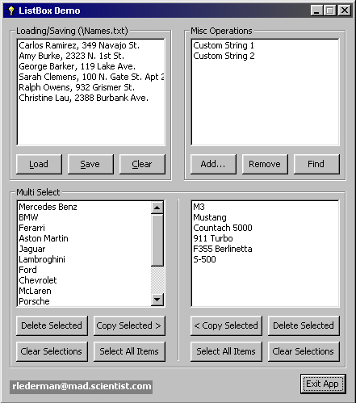



## ListBox Control Demo

### Description

Complete ListBox tutorial all on one form! I included the following features of the ListBox control:

Loading from file/Saving to file

Delete Item

Add Item

Find Item

Multi Selection Stuff:

Remove selected items

Copy selected items

Select all items

De-select all items

Note: The file that is used for the file loading procedure is included in the .zip file. It is called Names.txt . Try adding lines to this file or even changing the code to open C:\WINDOWS\WIN.INI
 
### More Info
 

             |
---                |---
**Submitted On**   |2000-06-06 00:30:46
**By**             |[One Light, Inc\.](https://github.com/Planet-Source-Code/PSCIndex/blob/master/ByAuthor/one-light-inc.md)
**Level**          |Intermediate
**User Rating**    |4.4 (22 globes from 5 users)
**Compatibility**  |VB 5\.0, VB 6\.0
**Category**       |[Custom Controls/ Forms/  Menus](https://github.com/Planet-Source-Code/PSCIndex/blob/master/ByCategory/custom-controls-forms-menus__1-4.md)
**World**          |[Visual Basic](https://github.com/Planet-Source-Code/PSCIndex/blob/master/ByWorld/visual-basic.md)
**Archive File**   |[CODE\_UPLOAD6472662000\.zip](https://github.com/Planet-Source-Code/one-light-inc-listbox-control-demo__1-8666/archive/master.zip)

